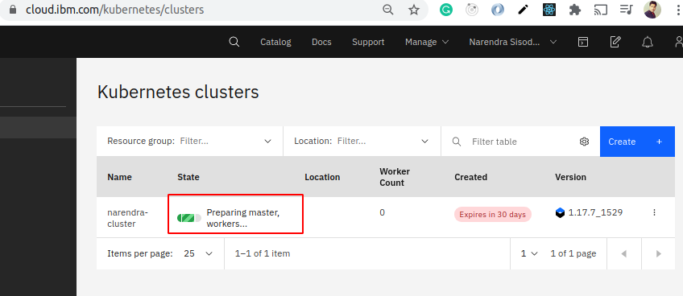
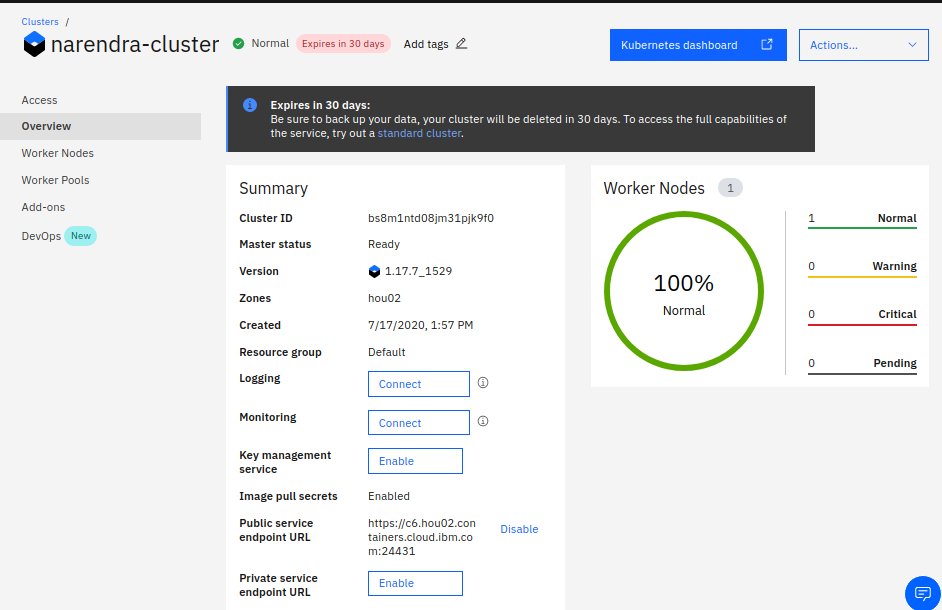
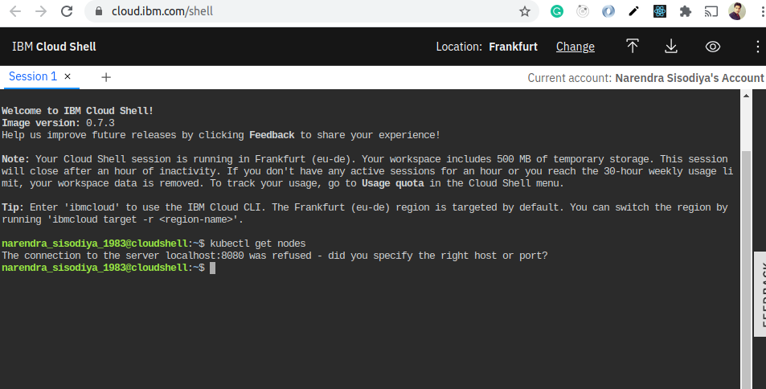
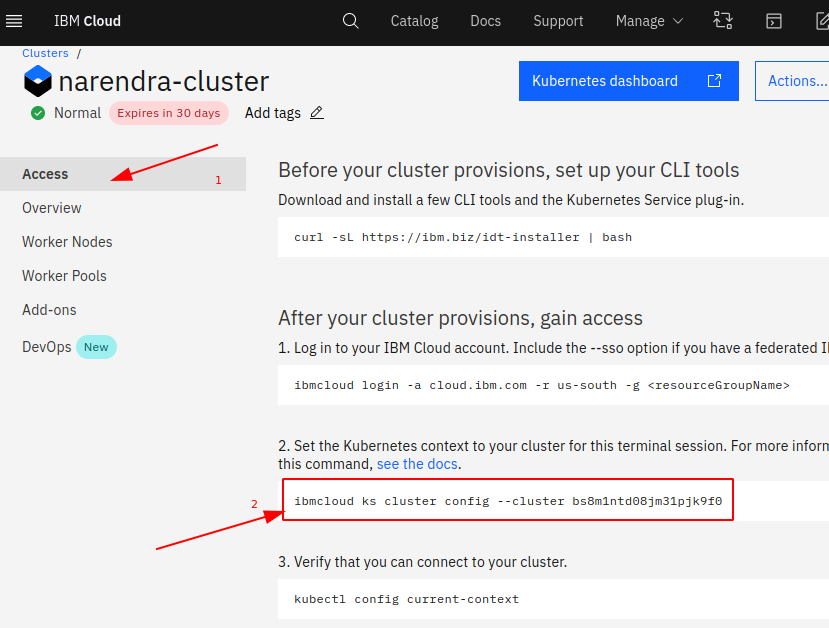
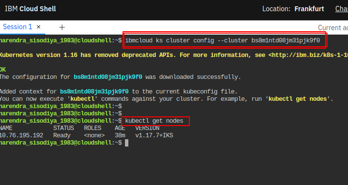
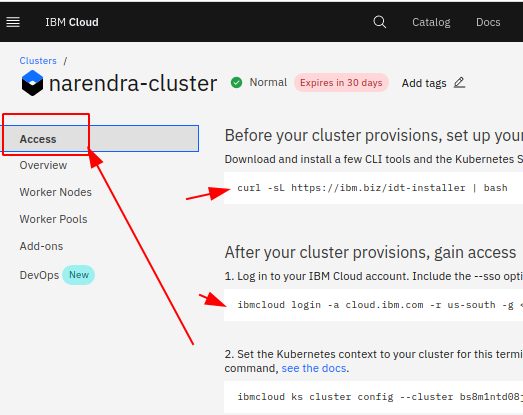
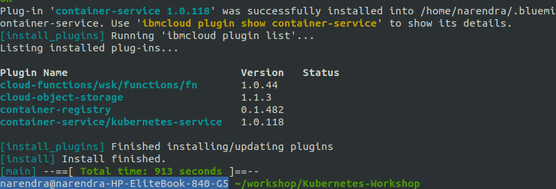
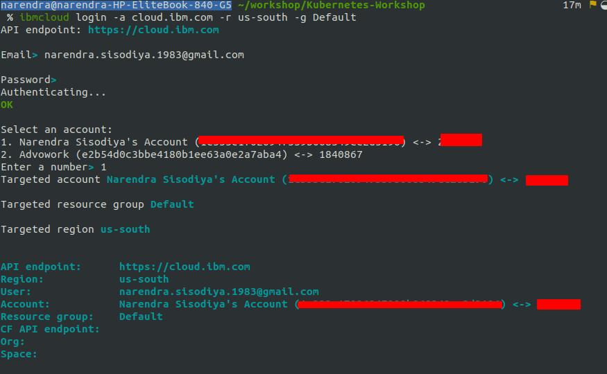
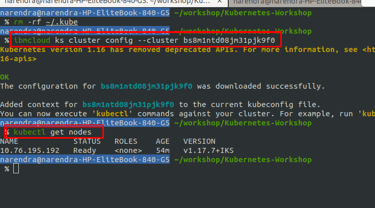
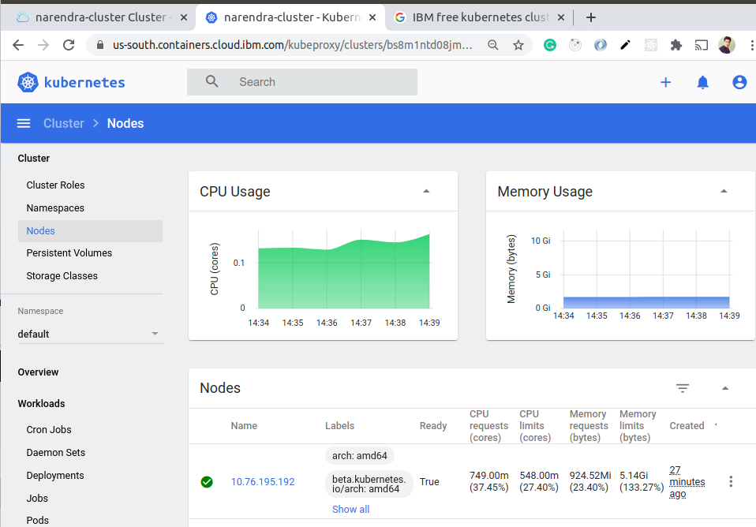

Visit - https://cloud.ibm.com/kubernetes/clusters and Click on `Create`

[](#)
<hr/>

Now click on Free cluster and Upgrade and Create your kubernetes cluster on IBM cloud.

[](#)
<hr/>

 Give name to your cluster - for me my cluster name is - `narendra-cluster`

[](#)
<hr/>

 Now visit again - https://cloud.ibm.com/kubernetes/clusters , you can see our cluster is preparing.

[](#)
<hr/>

It will take 10-15 minutes to full working Kubernetes cluster.

[](#)
<hr/>

After Sucess
[](#)
<hr/>

You can see, only 1 worker node is created.

Access from Cloud Shell
===========================

You can also use IBM cloud shell too to access the Cluster.

[](#)

This is how CloudShell look like

[](#)

`kubectl get nodes` giving error. because we need to connect to right API server.

So, to connect with your cluster, we need to run following command

```
ibmcloud ks cluster config --cluster bs8m1ntd08jm31pjk9f0
```
NOTE: You need to replace your cluster id in above command.

[](#)

[](#)


You can see I am getting following result in my cloud shell.

```
$ kubectl get nodes
NAME            STATUS   ROLES    AGE   VERSION
10.76.195.192   Ready    <none>   38m   v1.17.7+IKS
```

You should also get same result in your cloud shell.
Now lets connect Kubeternets from our Terminal from our system.

Setup Access from your System
===========================

Click on `Access` and follow instructions.

[](#)
<hr/>

1. Run the command

```
curl -sL https://ibm.biz/idt-installer | bash
```

You will see following result.

[](#)

2. Now Login to your IBM Cloud Account.

Follow instruction, you will run command similar to this

```
ibmcloud login -a cloud.ibm.com -r us-south -g Default
```
Check `Access` page for exact commands.

[](#)

Check I have logged in successfully. Now, lets connect.

```
ibmcloud ks cluster config --cluster bs8m1ntd08jm31pjk9f0
```
NOTE: You need to replace your cluster id in above command.

[](#)


Kubernetes Dashboard
====================
You can explore Kubernetes Dashboard from here

[](#)
<br/>

and this

[](#)
<br/>


Next?
============

So, we have done created our free k8s cluster which is free and having just 1 worker node.
Next step is deploy our hello world microservice code.

