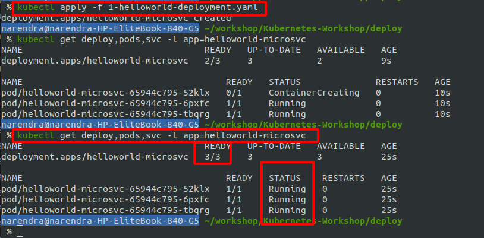
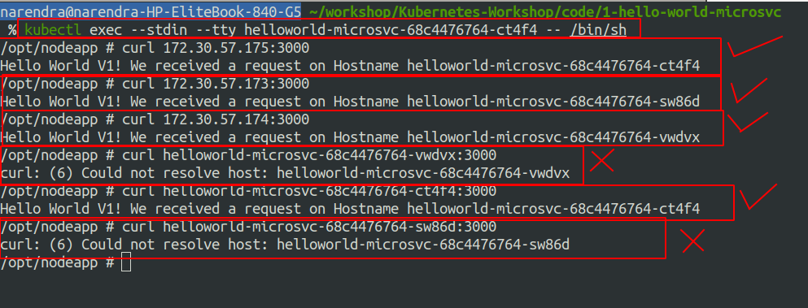
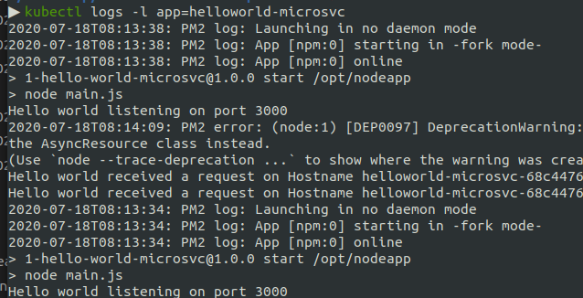

Chapter 4 -Deploy Our Docker Image On Cluster
=============================================

In Kubernetes, we can run multiple containers in a POD. But mostly we use one POD for 1 container.
`Deployment` can run multiple containers. So We will run 3 PODs using Deployments and After that we will use `Service` to expose our deployments.

Lets do it.

Deployment
==========
Lets deploy our image `nsisodiya/helloworld-microsvc:v1` from DockerHub.

Content of `1-helloworld-deployment.yaml`

```
kind: Deployment
apiVersion: apps/v1
metadata:
  name: helloworld-microsvc
  labels:
    app: helloworld-microsvc
spec:
  replicas: 3
  selector:
    matchLabels:
      app: helloworld-microsvc
  template:
    metadata:
      labels:
        app: helloworld-microsvc
    spec:
      containers:
        - name: helloworld-microsvc
          image: nsisodiya/helloworld-microsvc:v1
          imagePullPolicy: Always
          ports:
            - containerPort: 3000
          env:
            - name: TARGET
              value: World V1
```

Lets apply this deployments.

```
$ cd deploy
$ kubectl apply -f 1-helloworld-deployment.yaml

deployment.apps/helloworld-microsvc created

$ kubectl get deploy,pods,svc -l app=helloworld-microsvc
```
If you face problem with YML then you can validate at - https://kubeyaml.com/


[](#)


Explore Pods
=============
Lets play with pods with few commands.

```
kubectl get pods -owide
```

[](#)


Shell inside a pod
===================

Out of 3 pods, one pod is `helloworld-microsvc-68c4476764-ct4f4` and lets access shell inside this pod.

```
kubectl exec --stdin --tty helloworld-microsvc-68c4476764-ct4f4 -- /bin/sh
```

You can use `/bin/bash` if your image has bash shell.

inside container, you can try running `curl localhost:3000`

We have 3 containers, and you ping them from each other.

```sh
$ kubectl exec --stdin --tty helloworld-microsvc-68c4476764-ct4f4 -- /bin/sh
/opt/nodeapp $ curl 172.30.57.175:3000
Hello World V1! We received a request on Hostname helloworld-microsvc-68c4476764-ct4f4
/opt/nodeapp $ curl 172.30.57.173:3000
Hello World V1! We received a request on Hostname helloworld-microsvc-68c4476764-sw86d
/opt/nodeapp $ curl 172.30.57.174:3000
Hello World V1! We received a request on Hostname helloworld-microsvc-68c4476764-vwdvx
/opt/nodeapp $ curl helloworld-microsvc-68c4476764-vwdvx:3000
curl: (6) Could not resolve host: helloworld-microsvc-68c4476764-vwdvx
/opt/nodeapp $ curl helloworld-microsvc-68c4476764-ct4f4:3000
Hello World V1! We received a request on Hostname helloworld-microsvc-68c4476764-ct4f4
/opt/nodeapp $ curl helloworld-microsvc-68c4476764-sw86d:3000
curl: (6) Could not resolve host: helloworld-microsvc-68c4476764-sw86d
```
[](#)


Logs
=====
```
kubectl logs -l app=helloworld-microsvc
```
Output

[](#)

How to know running Image ID of a pod/container?
=====

```
kubectl describe pod helloworld-microsvc-68c4476764-ct4f4 | grep "Image ID"
```
or
Using `appLabel`
```
kubectl describe pod $(kubectl get pods -l app=helloworld-microsvc | grep Running | head -n1 | cut -f1 -d " ") | grep "Image ID"
```


Restart the deployment
=====
```
kubectl rollout restart deploy/helloworld-microsvc 
```
When we restart, IP and hostname changes.